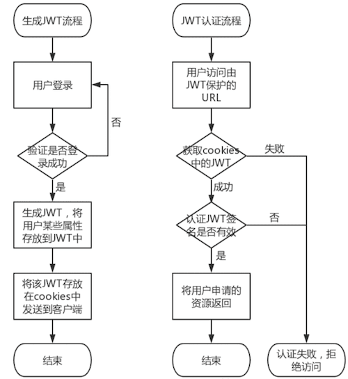
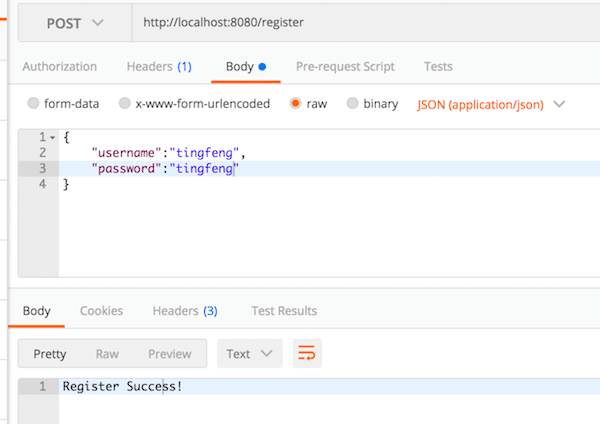
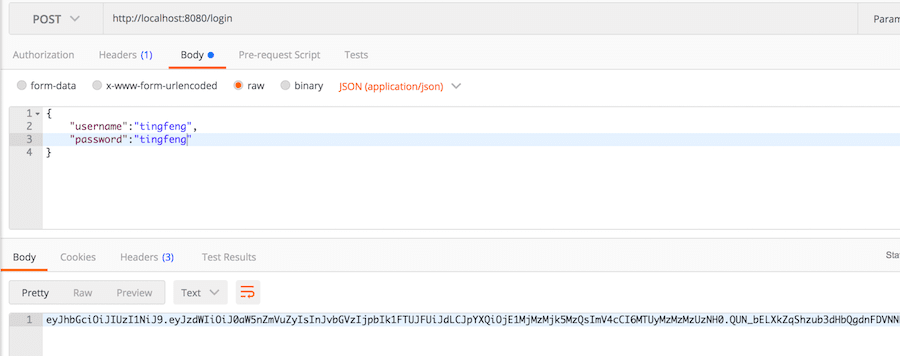
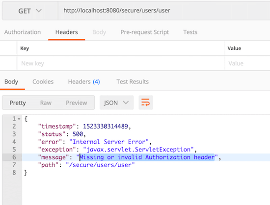
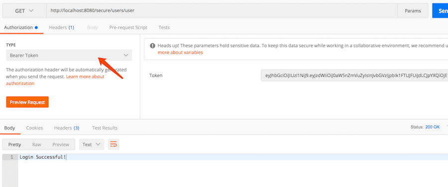
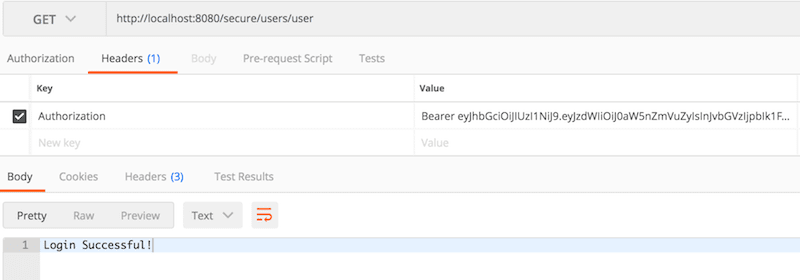

## Spring Boot实战之Filter实现使用JWT进行接口认证
用spring-boot开发RESTful API非常的方便，在生产环境中，对发布的API增加授权保护是非常必要的。现在我们来看如何利用JWT技术为API增加授权保护，保证只有获得授权的用户才能够访问API。

**作者：** 刘仁奎  
**主页：** http://ibloger.net / http://chengxumiao.net

### 一、初探JWT

#### 1、什么是JWT
JWT(Json Web Token)，是一种工具，格式为` XXXX.XXXX.XXXX `的字符串，JWT以一种安全的方式在用户和服务器之间传递存放在JWT中的不敏感信息。
#### 2、为什么要用JWT
设想这样一个场景，在我们登录一个网站之后，再把网页或者浏览器关闭，下一次打开网页的时候可能显示的还是登录的状态，不需要再次进行登录操作，通过JWT就可以实现这样一个用户认证的功能。当然使用Session可以实现这个功能，但是使用Session的同时也会增加服务器的存储压力，而JWT是将存储的压力分布到各个客户端机器上，从而减轻服务器的压力。
#### 3、JWT长什么样
JWT由3个子字符串组成，分别为Header，Payload以及Signature，结合JWT的格式即：` Header.Payload.Signature `。（Claim是描述Json的信息的一个Json，将Claim转码之后生成Payload）。

***Header***

Header是由以下这个格式的Json通过Base64编码（编码不是加密，是可以通过反编码的方式获取到这个原来的Json，所以JWT中存放的一般是不敏感的信息）生成的字符串，Header中存放的内容是说明编码对象是一个JWT以及使用“SHA-256”的算法进行加密（加密用于生成Signature）
```
{
	"typ":"JWT",
	"alg":"HS256"
}
```

***Claim***

Claim是一个Json，Claim中存放的内容是JWT自身的标准属性，所有的标准属性都是可选的，可以自行添加，比如：JWT的签发者、JWT的接收者、JWT的持续时间等；同时Claim中也可以存放一些自定义的属性，这个自定义的属性就是在用户认证中用于标明用户身份的一个属性，比如用户存放在数据库中的id，为了安全起见，一般不会将用户名及密码这类敏感的信息存放在Claim中。将Claim通过Base64转码之后生成的一串字符串称作Payload。
```
{
	"iss":"Issuer —— 用于说明该JWT是由谁签发的",
	"sub":"Subject —— 用于说明该JWT面向的对象",
	"aud":"Audience —— 用于说明该JWT发送给的用户",
	"exp":"Expiration Time —— 数字类型，说明该JWT过期的时间",
	"nbf":"Not Before —— 数字类型，说明在该时间之前JWT不能被接受与处理",
	"iat":"Issued At —— 数字类型，说明该JWT何时被签发",
	"jti":"JWT ID —— 说明标明JWT的唯一ID",
	"user-definde1":"自定义属性举例",
	"user-definde2":"自定义属性举例"
}
```

***Signature***

Signature是由Header和Payload组合而成，将Header和Claim这两个Json分别使用Base64方式进行编码，生成字符串Header和Payload，然后将Header和Payload以` Header.Payload `的格式组合在一起形成一个字符串，然后使用上面定义好的加密算法和一个密匙（这个密匙存放在服务器上，用于进行验证）对这个字符串进行加密，形成一个新的字符串，这个字符串就是Signature。如图所示


#### 4、JWT实现认证的原理
服务器在生成一个JWT之后会将这个JWT会以` Authorization : Bearer JWT ` 键值对的形式存放在cookies里面发送到客户端机器，在客户端再次访问收到JWT保护的资源URL链接的时候，服务器会获取到cookies中存放的JWT信息，首先将Header进行反编码获取到加密的算法，在通过存放在服务器上的密匙对` Header.Payload ` 这个字符串进行加密，比对JWT中的Signature和实际加密出来的结果是否一致，如果一致那么说明该JWT是合法有效的，认证成功，否则认证失败。

### 二、JWT实现用户认证的流程图


### 三、JWT的代码实现
#### 框架介绍
- Spring Boot（版本号：1.5.10）
- Apache Ignite（版本号：2.4.0）数据库
- jjwt（版本号：0.9.0）
- JDK（版本号：1.8）
- Gradle 或 Maven

#### 代码说明：

```
└── com
    └── tingfeng
        ├── AppRun.java   (运行入口，包含JWT过滤器配置)
        ├── config
        │   ├── IgniteCfg.java  （Ignite数据库配置与初始化）
        │   └── JwtConfig.java  （JWT常规配置）
        ├── controller
        │   ├── IndexController.java   
        │   ├── PersonController.java  （Person注册，登录接口）
        │   └── SecureController.java  （需要token的受限接口）
        ├── dao
        │   └── PersonRepository.java  （Person增删改查Dao）
        ├── filter
        │   └── JwtFilter.java         （JWT过滤器，处理与验证JWT的正确性）
        ├── model
        │   ├── Person.java
        │   ├── ReqPerson.java
        │   └── Role.java
        └── service
            ├── PersonService.java
            └── impl
                └── PersonServiceImpl.java
```

AppRun.java，没什么可说的，程序入口

```java
import com.tingfeng.filter.JwtFilter;
import org.apache.ignite.springdata.repository.config.EnableIgniteRepositories;
import org.springframework.boot.SpringApplication;
import org.springframework.boot.autoconfigure.SpringBootApplication;
import org.springframework.boot.web.servlet.FilterRegistrationBean;
import org.springframework.context.annotation.Bean;

/**
 * 该项目是用于将Ignite部署到SpringBoot上的一个测试性的项目
 * 目前的功能包含：
 * 	1. 启动并使用一个ignite节点
 * 	2. 提供api接口实现RESTful的设计，能够通过api添加与查询Cache中的相关内容
 *
 */
@SpringBootApplication
@EnableIgniteRepositories
public class AppRun {

	/**
	 * JWT 过滤器配置
	 */
	@Bean
	public FilterRegistrationBean jwtFilter() {
		final FilterRegistrationBean registrationBean = new FilterRegistrationBean();
		registrationBean.setFilter(new JwtFilter());
		registrationBean.addUrlPatterns("/secure/*");
		return registrationBean;
	}


	public static void main(String[] args) {
		SpringApplication.run(AppRun.class, args);
	}
}
```

我将JWT的过滤器设置在了AppRun这里，如果你不喜欢这种模式，也可以在`config`包下，创建一个`JwtCfg.java`的文件，文件内容如下

```java
/**
 * This is Jwt configuration which set the url "/secure/*" for filtering
 **/
@Configuration
public class JwtCfg {

    @Bean
    public FilterRegistrationBean jwtFilter() {
        final FilterRegistrationBean registrationBean = new FilterRegistrationBean();
        registrationBean.setFilter(new JwtFilter());
        registrationBean.addUrlPatterns("/secure/*");

        return registrationBean;
    }

}
```

`JwtFilter` 类 这个类声明了一个JWT过滤器类，从Http请求中提取JWT的信息，并使用了"secretkey"这个密匙对JWT进行验证
```java
import com.tingfeng.config.JwtConfig;
import io.jsonwebtoken.Claims;
import io.jsonwebtoken.Jwts;
import io.jsonwebtoken.SignatureException;
import org.springframework.web.filter.GenericFilterBean;

import javax.servlet.FilterChain;
import javax.servlet.ServletException;
import javax.servlet.ServletRequest;
import javax.servlet.ServletResponse;
import javax.servlet.http.HttpServletRequest;
import javax.servlet.http.HttpServletResponse;
import java.io.IOException;

/**
 * JWT 过滤器
 */
public class JwtFilter extends GenericFilterBean {

    @Override
    public void doFilter(final ServletRequest req, final ServletResponse res, final FilterChain chain)
            throws IOException, ServletException {

        final HttpServletRequest request = (HttpServletRequest) req;
        final HttpServletResponse response = (HttpServletResponse) res;

        //从Http请求获取授权
        final String authHeader = request.getHeader("authorization");

        // 如果Http请求是OPTIONS，那么只需返回状态码200，即代码中的HttpServletResponse.SC_OK
        // 除OPTIONS外，其他请求应由JWT检查
        if ("OPTIONS".equals(request.getMethod())) {
            response.setStatus(HttpServletResponse.SC_OK);

            chain.doFilter(req, res);
        } else {

            // Check the authorization, check if the token is started by "Bearer "
            if (authHeader == null || !authHeader.startsWith("Bearer ")) {
                throw new ServletException("Missing or invalid Authorization header");
            }

            // 然后从授权中获取JWT令牌
            final String token = authHeader.substring(7);

            try {
                // 使用JWT解析器检查签名是否对密钥“secretkey”有效
                final Claims claims = Jwts.parser().setSigningKey(JwtConfig.SECRET_KEY).parseClaimsJws(token).getBody();

                System.out.println("claims: " + claims);

                // Add the claim to request header
                request.setAttribute("claims", claims);
            } catch (final SignatureException e) {
                throw new ServletException("Invalid token");
            }

            chain.doFilter(req, res);
        }
    }
}
```
`PersonController` 类 这个类中在用户进行注册，登录操作成功之后，将生成一个JWT作为返回，如果你不想注册，那么在`IgniteCfg`中已经初始化了3条数据便于测试，启动时可见
```java

import com.tingfeng.config.JwtConfig;
import com.tingfeng.model.Person;
import com.tingfeng.model.ReqPerson;
import com.tingfeng.model.Role;
import com.tingfeng.service.PersonService;
import io.jsonwebtoken.Jwts;
import org.springframework.beans.factory.annotation.Autowired;
import org.springframework.web.bind.annotation.PostMapping;
import org.springframework.web.bind.annotation.RequestBody;
import org.springframework.web.bind.annotation.RestController;

import javax.servlet.ServletException;
import java.util.ArrayList;
import java.util.Date;
import java.util.List;

@RestController
public class PersonController {

    @Autowired
    private PersonService personService;

    /**
     * 用户注册
     */
    @PostMapping(value = "/register")
    public String register(@RequestBody() ReqPerson reqPerson) throws ServletException {

        // 检查输入
        if (reqPerson.getUsername() == "" || reqPerson.getUsername() == null || reqPerson.getPassword() == "" || reqPerson.getPassword() == null) {
            throw new ServletException("Username or Password invalid!");
        }

        // 检查用户是否已被注册
        if (personService.findPersonByUsername(reqPerson.getUsername()) != null) {
            throw new ServletException("Username is used!");
        }

        // 默认权限 : MEMBER
        List<Role> roles = new ArrayList<>();
        roles.add(Role.MEMBER);

        // 创建新的 Person 到 ignite DB
        personService.save(new Person(reqPerson.getUsername(), reqPerson.getPassword(), roles));

        return "Register Success!";
    }

    /**
     * 检查用户的登录信息，然后创建并返回给前端 jwt token 令牌
     *
     * @param reqPerson
     * @return jwt token
     * @throws ServletException
     */
    @PostMapping("/login")
    public String login(@RequestBody ReqPerson reqPerson) throws ServletException {

        // 检查输入
        if (reqPerson.getUsername() == "" || reqPerson.getUsername() == null || reqPerson.getPassword() == "" || reqPerson.getPassword() == null) {
            throw new ServletException("Please fill in username and password");
        }

        Person person = personService.findPersonByUsername(reqPerson.getUsername());

        // 检查用户是否存在。密码是否正确
        if (personService.findPersonByUsername(reqPerson.getUsername()) == null || !reqPerson.getPassword().equals(person.getPassword())) {
            throw new ServletException("Please fill in username and password");
        }

        // 创建 Twt token 令牌，将username，roles写入令牌
        String jwtToken = Jwts.builder()
                .setSubject(reqPerson.getUsername())
                .claim("roles", person.getRoles())
                .setIssuedAt(new Date())
                .setExpiration(JwtConfig.EXPIRATION_DATE)
                .signWith(JwtConfig.SIGNATURE_ALGORITHM, JwtConfig.SECRET_KEY)
                .compact();

        return jwtToken;
    }
}
```
`SecureController` 类 这个类中只是用于测试JWT功能，当用户认证成功之后，/secure 下的资源才可以被访问
```java
import io.jsonwebtoken.Claims;
import org.springframework.web.bind.annotation.PostMapping;
import org.springframework.web.bind.annotation.RequestMapping;
import org.springframework.web.bind.annotation.RestController;

import javax.servlet.http.HttpServletRequest;

/**
 * 测试JWT，如果验证成功直接返回数据，否则会被过滤器拦截
 */
@RestController
@RequestMapping("/secure")
public class SecureController {

    @RequestMapping("/users/user")
    public String loginSuccess() {
        return "Login Successful!";
    }

    @PostMapping("/user/roles")
    public Object checkRoles(HttpServletRequest request) {
        // 从token中获取用户角色
        Claims claims = request.getAttribute("claims") != null ? (Claims) request.getAttribute("claims") : null;
        return claims.get("roles");
    }

}
```
### 四、代码功能测试
本例使用Postman对代码进行测试，这里并没有考虑到安全性传递的明文密码，实际上应该用SSL进行加密

1. 首先进行一个新的测试用户的注册，可以看到注册成功的提示返回
	
2. 再让该用户进行登录，可以看到登录成功之后返回的JWT字符串

3. 直接申请访问` /secure/users/user` ，这时候肯定是无法访问的，服务器返回500错误

4. 将获取到的JWT作为Authorization属性提交（自动添加header），申请访问` /secure/users/user` ，可以访问成功

上图与下图类似，如果不用属性，手动添加也是一样的，都是请求添加header而已


### 五、错误记录

SpringBoot在2.0.1版本中会出现IgniteRepository的错误。

```java
Error:(16, 8) java: 名称冲突: org.springframework.data.repository.CrudRepository中的deleteAll(java.lang.Iterable<? extends T>)和org.apache.ignite.springdata.repository.IgniteRepository中的deleteAll(java.lang.Iterable<ID>)具有相同疑符, 但两者均不覆盖对方
```
springBootVersion = '1.5.10.RELEASE'

也不要使用1.5.11版本，不然会出现下面类型转换问题

```java
org.springframework.beans.factory.UnsatisfiedDependencyException: Error creating bean with name 'igniteCfg': Unsatisfied dependency expressed through field 'personService'; nested exception is org.springframework.beans.factory.UnsatisfiedDependencyException: Error creating bean with name 'personServiceImpl': Unsatisfied dependency expressed through field 'personRepository'; nested exception is org.springframework.beans.factory.BeanCreationException: Error creating bean with name 'personRepository': Invocation of init method failed; nested exception is java.lang.ClassCastException: com.tingfeng.config.IgniteCfg$$EnhancerBySpringCGLIB$$5b3f3d81 cannot be cast to org.apache.ignite.configuration.IgniteConfiguration
```


#### 参考地址
- [Java开发Json Web Token JWT的Java使用 (JJWT)](http://www.ibloger.net/article/3075.html)
- [程序开发JSON WEB TOKEN —— 什么是JWT？](http://www.ibloger.net/article/3064.html)
- [Spring Boot整合JWT实现用户认证](https://blog.csdn.net/ltl112358/article/details/79507148)
- [在Spring Boot上部署ignite数据库的小例子](https://blog.csdn.net/ltl112358/article/details/79399026)
